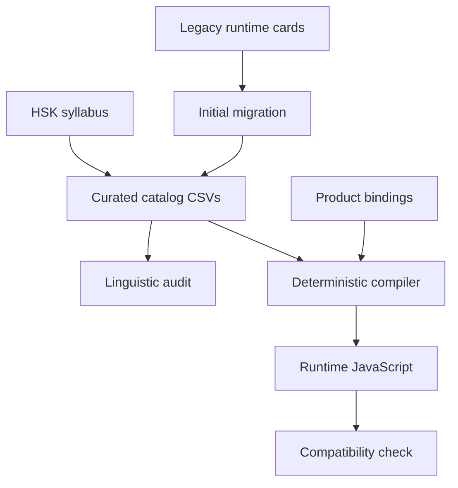

# Language content workspace

This directory separates Chinese-language curation from flashcard presentation. The catalog is the editorial source of truth; the browser continues to load generated JavaScript so the static runtime and existing user progress remain compatible.

## Directory map

| Path | Purpose | Owner |
| --- | --- | --- |
| `reference/` | Audited Chinese syllabus and aligned English translation | Reference, read-only |
| `data/catalog/` | Vocabulary, sentences, translations, grammar, hanzi, classifiers, and linguistic relations | Language content manager |
| `data/product_bindings/` | Active cards, direction, deck, runtime order, and legacy persistence keys | Product/runtime |
| `schemas/` | Machine-readable table contract and human data dictionary | Shared contract |
| `scripts/` | Import, audit, metadata reporting, and deterministic compilation | Language tooling |
| `reports/` | Generated inventory, coverage, ambiguity, and backlog snapshots | Generated evidence |
| `tests/` | Regression tests for parsing, invariants, and runtime equivalence | Shared quality |

## Data flow



The compiler joins linguistic content with product bindings. This lets the language owner change a translation or correct a sentence without deciding whether the product presents Chinese-to-English, English-to-Chinese, or Q&A cards.

## Initial migration

The first catalog snapshot contains:

- the complete 11,000-entry HSK vocabulary syllabus;
- the complete syllabus grammar, topic, task, recognition-hanzi, and writing-hanzi reference data;
- all 1,000 active vocabulary cards and their legacy English translations;
- all 1,562 sentence cards, their translations, vocabulary relations, and legacy grammar labels;
- 1,922 normalized utterances; the 360 Q&A model-answer translations missing from the legacy cards are an explicit backlog rather than fabricated data;
- all 655 active hanzi study records and all 268 classifier records;
- product bindings that freeze current IDs, directions, decks, and positional order.

Legacy content is deliberately labeled `legacy_unreviewed`. Migration preserves data; it does not pretend that every sentence, gloss, pinyin reading, or grammar tag received expert review.

The audit reports three separate views: the complete 11,000-sense syllabus roadmap, the product-bound published compatibility baseline, and approved-only editorial coverage. This prevents legacy surface coverage from being mistaken for reviewed sense coverage.

## Commands

Run a catalog audit and refresh the committed reports:

```bash
python3 language/scripts/audit_catalog.py --write-reports
```

Validate catalog compilability without changing or requiring synchronization with the app runtime:

```bash
python3 language/scripts/compile_runtime_catalog.py --validate
```

Check semantic synchronization with the JavaScript currently loaded by the app:

```bash
python3 language/scripts/compile_runtime_catalog.py --check-runtime
```

Publish approved catalog changes to the runtime chunks:

```bash
python3 language/scripts/compile_runtime_catalog.py --write
python3 language/scripts/compile_runtime_catalog.py --check-runtime
```

Run pipeline regression tests:

```bash
python3 language/tests/test_language_pipeline.py
```

See `schemas/README.md` for column definitions and `AGENTS.md` for the editorial policy.
